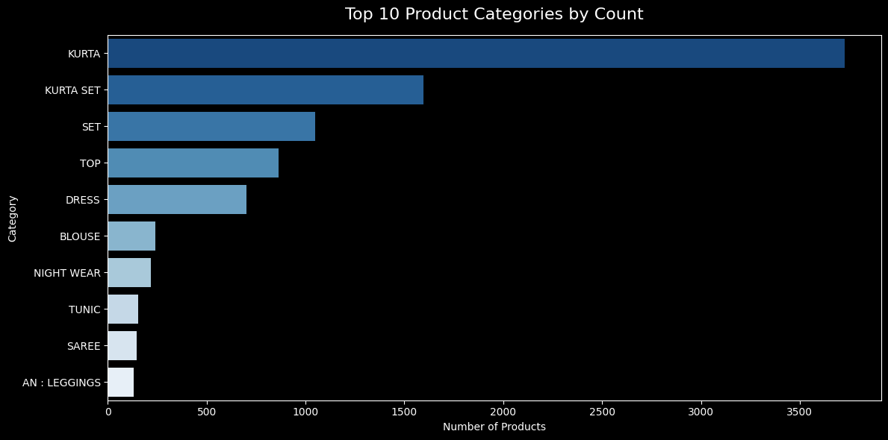
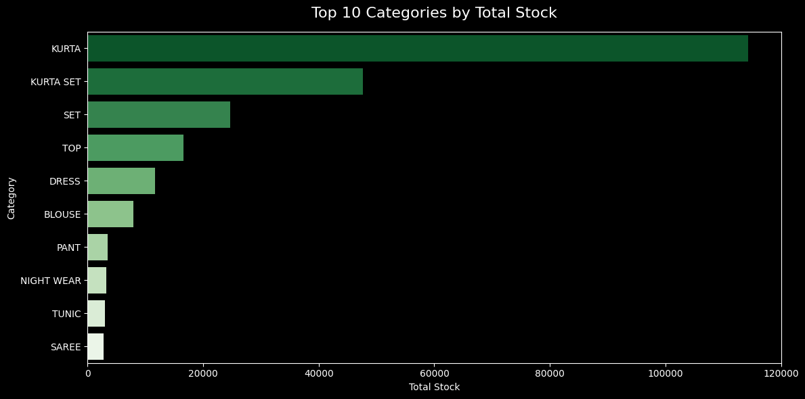
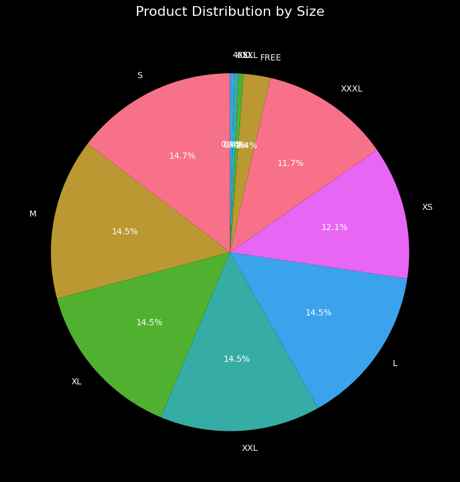
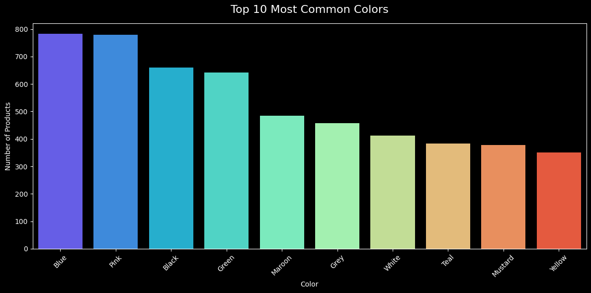
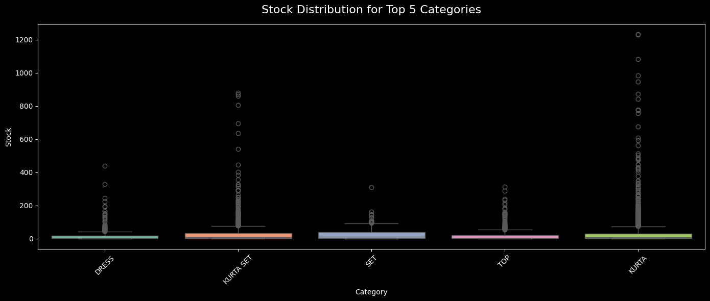
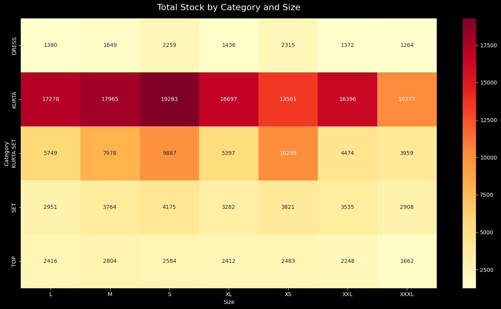

# E-Commerce Fashion Sales EDA
## Python | Pandas | Matplotlib | Seaborn


## Project Overview
An exploratory data analysis of an Indian e-commerce 
fashion retail dataset containing 9,235 products across 
22 categories, 63 colors and 11 size variants.

---

## Tech Stack
| Tool | Purpose |
|---|---|
| Python 3 | Core programming language |
| Pandas | Data loading, cleaning, analysis |
| Matplotlib | Data visualization |
| Seaborn | Statistical visualizations |
| Google Colab | Cloud-based notebook environment |

---

## Dataset
- Source: Kaggle — E-Commerce Sales Dataset
- Records: 9,235 products (after cleaning)
- Features: SKU Code, Category, Size, Color, Stock
- Domain: Indian ethnic fashion retail

---

## Project Highlights
- Loaded and inspected raw CSV data using pandas
- Identified and handled missing values strategically
  — dropped rows with missing Stock values
  — filled missing categorical values with 'Unknown'
- Performed categorical analysis across 22 product 
  categories, 63 colors and 11 size variants
- Built 6 professional visualizations using 
  matplotlib and seaborn
- Derived actionable business insights from the data

---

## Key Findings

### 📦 Inventory
- Total stock: **242,386 units** across 9,235 products
- Average stock per item: **26.25 units**
- Highest single SKU stock: **1,234 units**

### 👗 Categories
- **KURTA dominates** with 40.3% of all products
- KURTA holds **47.2% of total stock** (114,339 units)
- Top 3 categories (KURTA, KURTA SET, SET) account 
  for **77.1% of total inventory**

### 📏 Sizes
- Size distribution is remarkably even across 
  S, M, L, XL, XXL (each ~14.5%)
- **96.4%** of products come in standard sizes (XS-XXXL)
- Indicates a well-planned size-inclusive strategy

### 🎨 Colors
- **63 unique colors** in the catalog
- Blue (782) and Pink (779) are nearly equal top colors
- Top 5 colors: Blue, Pink, Black, Green, Maroon

---

## Visualizations

### Category Analysis


### Stock Distribution


### Size Distribution


### Color Analysis


### Stock Box Plot


### Stock Heatmap by Category & Size


---

## Skills Demonstrated
```python
# Data Loading & Inspection
pd.read_csv(), df.shape, df.dtypes, df.isnull().sum()

# Data Cleaning
df.dropna(), df.fillna(), df.drop()

# Analysis
df.describe(), df.groupby(), df.value_counts()
df.nunique(), df.pivot_table()

# Visualization
sns.barplot(), sns.boxplot(), sns.heatmap()
plt.pie(), plt.figure(), plt.tight_layout()
```

---

## How to Run
1. Open Google Colab: colab.research.google.com
2. Upload `ecommerce_sales_eda.ipynb`
3. Upload `Sale Report.csv`
4. Run all cells in order

---

## Author
**Your Name**
Aspiring Data Analyst
[LinkedIn](https://linkedin.com/in/yourprofile) |
[GitHub](https://github.com/yourusername)

